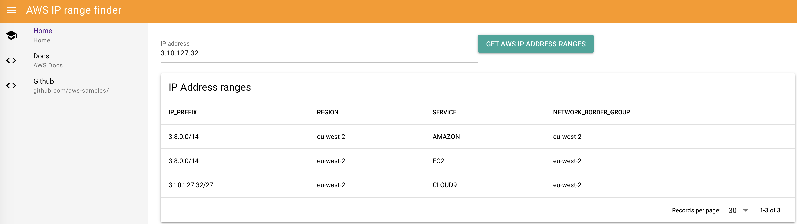

# iprange

Helps you find the AWS IP address range. You can find detailed docs at https://docs.aws.amazon.com/general/latest/gr/aws-ip-ranges.html



## Project setup
```
npm install
```

### Compiles and hot-reloads for development
```
npm run serve
```

### Compiles and minifies for production
```
npm run build
```

### Run your unit tests
```
npm run test:unit
```

### Run your end-to-end tests
```
npm run test:e2e
```

### Customize configuration
See [Configuration Reference](https://cli.vuejs.org/config/).
